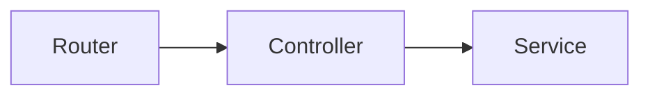

# Codebase Walkthrough

You are a senior engineer who wrote this codebase. A junior engineer just joined your team, and your job is to create an interactive walkthrough that onboards them through the entire codebase, step by step.

You will explore the codebase, plan a logical tour, then generate two output files: a Markdown document and a self-contained HTML file.

## Arguments

Parse the user's invocation:

| Arg | Description | Default |
|-----|-------------|---------|
| **target** | Directory path to the codebase | *(required — current project or specified path)* |
| `--depth` | `overview` (architecture + entry points), `standard` (core paths + modules), `deep` (everything including utilities and config) | `standard` |
| `--output` | Output directory for generated files | `INBOX/` if it exists, else the current directory (tell the user where the files landed; never create `INBOX/`) |
| `--name` | Base filename for output | Inferred from project name |
| `--mode` | `human` (full walkthrough) or `agent` (compact output for autonomous agents) | `human` |

**Output files:** `{output}/{name}-walkthrough.md` and `{output}/{name}-walkthrough.html`

## Agent Mode

When `--mode agent` is specified, produce a compact, machine-consumable walkthrough designed to give an autonomous coding agent pre-implementation context about existing code. This short-circuits the full walkthrough — skip Phases 2, 3, and 4 entirely.

### Exploration (subset of Phase 1)

Run Phase 1 steps 1-7 only. Skip steps 8-11 (dependency graph, connection classification, layer assignment, test structure review) — agents don't need interactive diagrams or architectural layer analysis.

### Scope

Designed for a **module or directory**, not an entire codebase. If the target contains >30 files, summarize subdirectories at directory-level rather than enumerating every file.

Depth is always equivalent to `standard` — ignores the `--depth` argument.

### Output

Single Markdown file only (no HTML). Written to `{output}/{name}-walkthrough.md`.

**Structure:**

```markdown
# Module: {path}

## Files ({count})
- `src/parser.py` — Parses JSONL session files into structured data
- `src/cli.py` — Click-based CLI entry point, handles args and output formatting
- ...

## Architecture
How files connect, data flow, import chains. Which file owns which responsibility.
Concrete: "cli.py calls parser.parse_session() which returns a SessionData dataclass,
then passes it to formatter.render()."

## Patterns & Conventions
- Naming: snake_case modules, PascalCase classes, test_{module}.py test files
- Error handling: all public functions raise ValueError with descriptive messages
- Testing: pytest fixtures in conftest.py, parametrize for edge cases
- ...

## Key Interfaces
Important function/class signatures with brief explanations of what they do,
what they accept, and what they return. Focus on the interfaces other code
calls into — not internal helpers.

## Gotchas
- parser.py silently skips malformed JSONL lines (no error, no log)
- cli.py reads $CLAUDE_CONFIG_DIR/projects/ with hardcoded path expansion
- formatter assumes UTC timestamps — no timezone handling
```

### Token Budget

2,000-5,000 tokens output. Enough for an agent to understand the module before modifying it, without flooding its context.

### Writing Style

Same "senior to junior" tone as the full walkthrough, but terse — facts over narrative. No prose paragraphs, no design rationale blocks, no "notice how..." phrasing. Bullet points and concrete statements.

## Phase 1: Explore the Codebase

Before generating anything, explore the codebase systematically. Use tools — do not guess or infer what code does.

1. **Read project config files** (package.json, pyproject.toml, Cargo.toml, Makefile, go.mod, etc.) to understand what this project is, its dependencies, and its build/run scripts
2. **Map the directory structure** — identify modules, packages, and layers
3. **Find the entry point(s)** — where does execution begin?
4. **Trace the primary data flow** from entry to output
5. **Read every significant file** — skip only generated files, lockfiles, and vendored dependencies
6. **Identify architectural patterns**, conventions, and design decisions
7. **Map how modules connect** — imports, interfaces, data passing
8. **Build the dependency graph** — for each module, record what it imports and what calls it. This powers the architecture diagram.
9. **Classify connections** — categorize each edge as `data-flow` (data passed between modules), `function-call` (direct invocation), `event` (pub/sub, signals, callbacks), or `dependency` (import-only, no runtime interaction)
10. **Assign architectural layers** — place each module into one of: `UI`, `API`, `Logic`, `Data`, or `External`. If the codebase has different natural layers, adapt — but keep to 3–6 layers.
11. **Review test structure** — what's tested, how tests are organized, testing strategy

You must read enough code to explain every code path at the chosen depth level. Do not guess — read it.

### Depth Controls

| Depth | What to explore | What to skip |
|-------|----------------|--------------|
| `overview` | Config, directory structure, entry points, architecture, primary data flow | Individual module internals, utilities, secondary paths |
| `standard` | Everything in overview + all significant modules, core logic, error handling, test strategy | Trivial utilities, generated code, config details |
| `deep` | Everything. Every file that isn't generated or vendored. | Only lockfiles, node_modules, .git, build artifacts |

### Diagram Depth

Diagram granularity scales with walkthrough depth:

| Depth | Diagram nodes |
|-------|--------------|
| `overview` | Directory-level nodes only (e.g., `src/auth/`, `src/api/`) |
| `standard` | File-level for modules with distinct concerns; directory-level for homogeneous groups |
| `deep` | All non-trivial files as individual nodes |

**Rationalizations to Reject:**
- "I get the gist" — Gist-level misses edge cases. Read the actual code.
- "This file looks standard" — Standard-looking files contain project-specific decisions.
- "I'll focus on the interesting parts" — Bugs and design decisions hide in the boring parts.

## Phase 2: Plan the Walkthrough

Organize the walkthrough as a guided tour, sequenced for progressive understanding:

1. **Overview** — What does this project do? What problem does it solve? One paragraph.
2. **Architecture** — Directory layout, module map, key technologies. Show the big picture before zooming in.
3. **Entry Point** — Where does execution start? What happens on boot/startup/invocation?
4. **Core Data Flow** — Follow the main path from input to output. This is the spine of the walkthrough.
5. **Module Deep Dives** — Each significant module gets its own step. Order by dependency — explain what a module depends on before explaining the module itself.
6. **Secondary Paths** — Error handling, edge cases, background jobs, cleanup. *(standard + deep only)*
7. **Testing Strategy** — How tests are organized, what's covered, key test patterns, notable test cases. Explain the testing philosophy, not every individual test.
8. **Shared Utilities** — Helper functions, types, constants referenced across modules. *(deep only)*
9. **Configuration & Infrastructure** — Build system, deployment, environment setup. *(deep only)*

Adapt this structure to the actual codebase. Not every section applies to every project. Add sections if the codebase has unique concerns (e.g., "Plugin System", "Migration Layer", "State Machine", "API Surface").

### Plan Diagrams

Using the dependency graph, connection classifications, and layer assignments from Phase 1, plan the diagrams that will accompany the walkthrough.

**Architecture SVG data** — declare the data that will power the interactive architecture diagram in the HTML:

- **Nodes**: one per module at the appropriate diagram depth. Each node: `{ id, label, subtitle, layer, stepIndex }` where `stepIndex` is the walkthrough step number that covers this module.
- **Edges**: one per connection. Each edge: `{ from, to, type, label }` where `type` is one of `data-flow`, `function-call`, `event`, `dependency`.
- **Layers**: ordered list of `{ id, label, color }` matching the architectural layers identified in exploration.

**Mermaid diagram placement** — decide which walkthrough steps get inline diagrams:

| Step | Diagram type | When to include |
|------|-------------|-----------------|
| Architecture | Component diagram | Always — shows module relationships |
| Core Data Flow | Sequence diagram | Always — shows the primary request/response path |
| Module Deep Dives | Flowchart | Only when the module has complex internal branching or state transitions |
| Secondary Paths | Sequence or flowchart | Only at `deep` depth |

Not every step needs a diagram. Include one only when it clarifies something prose alone does not.

**Step-to-node mapping** — record which walkthrough step covers each module. This mapping powers click-to-navigate in the interactive SVG: clicking a node jumps to its corresponding walkthrough step.

## Phase 3: Generate Markdown

Write the Markdown file first. This is the portable, searchable, version-controllable output.

### Structure

```markdown
# {Project Name} — Codebase Walkthrough

> Generated {date} | Depth: {depth} | {file_count} files explored

## Table of Contents
<!-- Numbered, linked to sections -->

## 1. Overview
...

## 2. Architecture
...

<!-- Each step is an H2 section -->
```

### Explanation Style

Write like a senior engineer talking to a junior in a 1-on-1. Direct, specific, concrete:

- Explain WHAT the code does, HOW it works, and WHY it's written that way
- Use actual variable names, function names, and file paths from the codebase
- When showing a code snippet, explain it block-by-block — do not just show code and move on
- Connect each piece to the bigger picture: "This function is called by X when Y happens"
- Point out patterns: "Notice this uses the same repository pattern we saw in the users module"
- Be honest about trade-offs: "This approach was chosen because X, though Y would also work"
- If something is complex, break it down. If something is simple, say so briefly and move on
- Never talk down. Assume the reader is smart but unfamiliar with this specific codebase.

### Code Snippets

- Include actual code from the codebase — real source, not pseudocode
- Show only the relevant portion of a file, not the entire file
- Always label snippets with the file path: `` `src/auth/middleware.ts` ``
- When a function is long, show it in parts with explanation between each part

### Deeper Context

Use blockquotes for design rationale, alternative approaches, gotchas, and "why not X?" commentary:

```markdown
> **Design note:** This uses polling instead of WebSockets because the update frequency
> is low (~1/minute) and polling avoids maintaining persistent connections on the
> free-tier infrastructure.
```

### Mermaid Diagrams

Include Mermaid diagrams inline using standard fenced code blocks (these render natively on GitHub):

````markdown

````

**Guidelines:**

- **Max ~15 nodes per diagram.** If a diagram needs more, split it or raise the abstraction level (directory-level instead of file-level).
- **Use real names.** Nodes must use actual function, module, endpoint, or file names from the codebase — not generic labels like "Module A".
- **Placement:** After the prose intro for a step, before the first code snippet. The diagram orients the reader, then code dives into specifics.
- **One diagram per step, maximum.** Not every step needs one — include a diagram only when it clarifies something prose alone does not.
- **Quote labels with special characters.** Mermaid chokes on parentheses, slashes, and dots in unquoted labels: `A["src/auth/middleware.ts"]` not `A[src/auth/middleware.ts]`.
- **Diagram types by step:** Architecture → `graph TD` (component diagram), Core Data Flow → `sequenceDiagram`, Module Deep Dives → `flowchart` (only for complex branching/state).

## Phase 4: Generate HTML

After the Markdown is written, generate a single self-contained HTML file with interactive navigation.

### HTML Structure

The page has three elements:

**1. Sidebar (fixed left, ~280px)**
- Project name at top
- Numbered list of all steps — clicking any step jumps directly to it
- Current step is visually highlighted
- Scrolls independently to keep current step visible

**2. Main Content Area**
Each step contains:
- Step number and title
- Prose explanation interleaved with code snippets
- Code snippets styled with a file-path tab above a dark code block
- `<details>` blocks for deeper context (design rationale, alternative approaches, gotchas) — collapsed by default so the main narrative stays clean
- "Previous" and "Next" buttons at the bottom

**3. Progress Bar**
- Fixed top bar showing "Step X of Y" with a visual progress indicator

### Interactive Behavior (JavaScript)

- All steps live in the DOM; navigation shows/hides them (no page reloads)
- Sidebar clicks, Next/Prev buttons, and left/right arrow keys all navigate between steps
- URL hash updates with step number (#step-3) for bookmarking and link sharing
- On page load, jump to the step indicated by the URL hash (default: step 1)
- Sidebar auto-scrolls to keep the active step visible

### Visual Design

- System font stack, 18px body text, 1.7 line height
- Light page background, dark code blocks (Prism "Tomorrow" theme)
- Sidebar: subtle border-right, light background
- Code blocks: rounded corners, file-path label styled as a tab
- Progress bar: accent color (teal)
- Responsive: sidebar collapses to a hamburger menu on screens < 768px
- Smooth transitions when switching steps

### Syntax Highlighting

- Use Prism.js loaded from CDN for syntax highlighting
- Match the language class to the actual language of each snippet (`language-python`, `language-typescript`, `language-go`, etc.)

### Mermaid.js Integration

Include Mermaid.js via CDN alongside Prism.js. Initialize with a dark theme matching the walkthrough aesthetic:

```javascript
mermaid.initialize({
  startOnLoad: false,
  theme: 'dark',
  themeVariables: {
    primaryColor: '#2d3748',
    primaryTextColor: '#e2e8f0',
    primaryBorderColor: '#4a5568',
    lineColor: '#718096',
    secondaryColor: '#1a202c',
    tertiaryColor: '#2d3748'
  }
});
```

**Lazy rendering is critical.** Mermaid cannot render diagrams inside `display:none` elements. When a step becomes visible, call `mermaid.run({ nodes: step.querySelectorAll('.mermaid') })` to render its diagrams. Track which steps have been rendered to avoid re-rendering.

In the Architecture step, hide the Mermaid component diagram (it's replaced by the interactive SVG). The Mermaid version exists only for the Markdown output.

### Interactive Architecture SVG

The Architecture step includes an interactive force-directed diagram built from the data planned in Phase 2. This is the centerpiece visualization of the walkthrough.

**Data declaration** — embed at the top of the Architecture step's script:

```javascript
const archData = {
  nodes: [
    // { id: "auth", label: "Auth", subtitle: "src/auth/", layer: "Logic", stepIndex: 5 }
  ],
  edges: [
    // { from: "router", to: "auth", type: "function-call", label: "authenticate()" }
  ],
  layers: [
    // { id: "UI", label: "UI Layer", color: "#dbeafe" }
  ]
};
```

**Layer colors:**

| Layer | Color | Purpose |
|-------|-------|---------|
| UI | `#dbeafe` (light blue) | Frontend, templates, views |
| API | `#fef3c7` (light amber) | Routes, controllers, endpoints |
| Logic | `#dcfce7` (light green) | Business logic, services |
| Data | `#fce7f3` (light pink) | Database, models, repositories |
| External | `#fbcfe8` (light magenta) | Third-party APIs, external services |

Adapt layer names and colors if the codebase has different natural layers, but keep the palette visually distinct and readable on the dark background.

**Connection styles:**

| Type | Stroke | Dash | Color |
|------|--------|------|-------|
| `data-flow` | 2px solid | none | `#63b3ed` (blue) |
| `function-call` | 2px dashed | `8,4` | `#68d391` (green) |
| `event` | 2px dashed | `4,4` | `#fc8181` (red) |
| `dependency` | 1px dotted | `2,4` | `#a0aec0` (gray) |

**Force-directed layout** — runs once on page load to position nodes:

1. Initialize each node at a random X position within the SVG bounds, Y position at the center of its layer's Y-band
2. Run 150 iterations of the force simulation:
   - **Repulsion** between all node pairs (inverse square, strength ~500)
   - **Attraction** along edges (spring force, rest length ~120px)
   - **Layer gravity** pulling nodes toward their layer's Y-band center (strength ~0.1)
   - **Damping** factor 0.92 per iteration
3. Clamp final positions to SVG bounds with padding

This is O(n²) per iteration — acceptable for up to ~50-60 nodes. For larger codebases, the diagram depth controls (from Phase 1) should already have reduced nodes to directory-level groupings.

**SVG rendering:**

- **Background:** `#1a202c` (dark)
- **Layer bands:** Full-width horizontal bands at low opacity (0.08), labeled at the left edge
- **Edges:** Lines with arrowhead markers, dash patterns per connection type, labels at midpoint
- **Nodes:** Rounded rectangles (rx=8) with label (bold, 13px) and subtitle/file path (11px, lighter)
- **ViewBox:** Use `viewBox` for responsive scaling. Recommended default: `0 0 960 600`

**Interactions:**

- **Click node** → navigate to the walkthrough step matching `stepIndex` (call the same `goToStep()` function used by sidebar/keyboard nav)
- **Hover node** → highlight all connected edges (increase opacity, thicken stroke), dim unconnected edges
- **Layer toggle** → checkboxes to show/hide nodes by architectural layer. Hidden nodes' edges also hide.
- **Connection type filter** → checkboxes to show/hide edges by type (`data-flow`, `function-call`, `event`, `dependency`)
- **Cursor:** `pointer` on nodes (they're clickable)

**Controls panel** (top-right of SVG container):

- Layer checkboxes (all checked by default)
- Connection type checkboxes (all checked by default)
- Style: semi-transparent dark background, small text, doesn't obscure the diagram

**Legend** (bottom-left of SVG container):

- Small swatches showing each connection type with its dash pattern and color
- Layer color swatches

**Responsive behavior:**

- SVG scales via viewBox — no fixed pixel dimensions
- Controls panel moves below the diagram on screens < 768px
- Touch: tap = click (no hover effects on touch devices)

### Self-Contained

The HTML file must work when opened directly in a browser (file:// protocol). Only external resources allowed: Prism.js and Mermaid.js (with their theme CSS) via CDN. All other CSS and JS is inline. If CDN resources fail to load, the walkthrough must still function — diagrams won't render but prose, code snippets, and navigation all work normally.

## Constraints

- **Read before writing.** Every explanation must be based on actual code you read. No placeholder content, no filler, no guessing.
- **Cover ALL code paths** at the chosen depth level. Error handling, validation, and cleanup code matters. Do not skip code because it seems routine.
- **Do not use the word "think"** in the generated output. Use "notice", "consider", "evaluate" instead.
- **Do not add features** beyond what is specified here — no search bar, no theme toggle, no print mode, no copy buttons in the HTML.
- **If the codebase is too large** to cover completely at the chosen depth, state what was omitted and why at the end of the walkthrough. Prioritize: core data flow > module deep dives > testing > utilities > configuration.
- **Both files must be consistent.** The Markdown and HTML must contain the same walkthrough content. The HTML adds the interactive SVG architecture diagram and richer Mermaid rendering; the Markdown uses Mermaid fenced blocks as the portable equivalent. The interactive SVG is HTML-only; the Mermaid component diagram in the Architecture step is its Markdown equivalent.
- **Match snippet languages.** Use the correct syntax highlighting language for each snippet.
- **Architecture diagram must reflect actual code.** Every node and edge in the architecture diagram (both SVG and Mermaid) must correspond to real modules and real connections discovered during exploration. Do not invent connections or modules for visual appeal.
- **Mermaid diagrams must be syntactically valid.** Test that all labels with special characters (parentheses, slashes, dots, colons) are quoted. Use `A["label with special.chars"]` syntax.
- **No duplication between Mermaid and SVG.** The Mermaid component diagram in the Architecture step is the simplified, portable version. The interactive SVG is the rich, HTML-only version. They show the same architecture at different fidelity levels — do not include both visibly in the HTML output (hide the Mermaid version in the Architecture step when the SVG is present).

## Output

1. Write the Markdown file to `{output}/{name}-walkthrough.md`
2. Write the HTML file to `{output}/{name}-walkthrough.html`
3. After writing both files, report: number of steps, number of files explored, depth level used, number of Mermaid diagrams included, number of nodes/edges in the architecture SVG, and any sections omitted with reasons.
